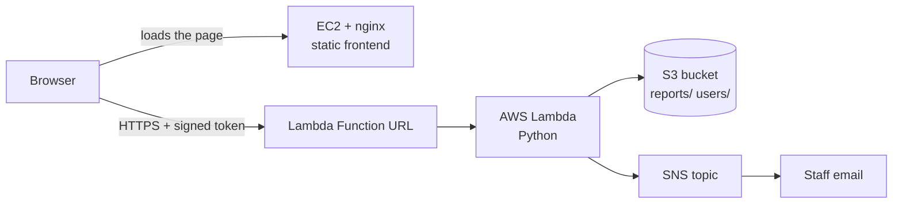

# CampusCare

A small campus issue-reporting portal built on AWS. Students log in and report maintenance problems, cleanliness issues, complaints, suggestions and lost or found items. Staff are emailed straight away, and admins review, track and analyse the reports.

Built for a Cloud Computing Essentials assignment (EC2, Lambda, S3, SNS), then extended with login, roles, an admin dashboard and tamper detection.

> **Live demo:** the page has a built-in demo mode (no AWS needed). Once GitHub Pages is on, it runs at `https://YOUR-USERNAME.github.io/campuscare/`. Admin login in demo mode: `admin` / `admin1234`. Students can use any ID and an 8+ character password. Demo data is not saved.

<!--  -->
<!--  -->

## Features

- **Homepage and login:** students create an account with their enrollment number; staff use an admin account.
- **Report form:** type, title, location, description and an optional photo (shrunk in the browser before upload). Six types: Maintenance, Cleanliness, Complaint, Suggestion, Lost & Found, Other.
- **Student view:** students see only their own reports.
- **Admin view:** all reports, filters and search, a status control (Open, In Progress, Resolved) and a per-report history.
- **Analytics tab (admin):** reports by type, top locations, reports per week, and plain-language flags such as "a location with 3 or more reports".
- **Email notification:** every new report is published to an SNS topic, which emails the subscribed staff member.
- **Tamper check:** each report stores a SHA-256 hash of its core fields. The admin view shows "Verified, unchanged" or a warning.
- **Light and dark theme**, responsive layout.

## Architecture



| Service | Role |
|---|---|
| **EC2** (nginx) | Serves the static frontend |
| **Lambda + Function URL** | The whole backend: register, login, submit report, list reports, update status |
| **S3** | Report JSON (`reports/CC-001.json`), photos (`reports/CC-001.jpg`) and user accounts (`users/`) |
| **SNS** | Email notification on each new report |

No database is used. Report IDs (`CC-001`, `CC-002`, ...) are made safe against clashes with S3 conditional writes (`IfNoneMatch`): if two people pick the same number, the second write is refused and retries with the next one.

## How security works

- Passwords are hashed with PBKDF2-SHA256 (200,000 iterations) with a random salt, and never stored in plain text.
- Login returns a signed token (HMAC-SHA256, expires after 8 hours). Every API call except login and register needs it.
- The server checks the role on every request: only students can submit, only admins can change status or see everyone's reports.
- The bucket is private. Photos are shown through temporary signed links (1 hour).
- The Lambda role can only touch this one bucket and this one topic (see `backend/iam-policy.example.json`).
- The page builds all user content with `textContent`, so report text cannot inject HTML.

## Project structure

```
campuscare/
├── docs/                      frontend (served by EC2 or GitHub Pages)
│   ├── index.html
│   └── screenshots/
├── backend/
│   ├── lambda_function.py     Lambda handler (Python)
│   └── iam-policy.example.json
├── .gitignore
├── LICENSE
└── README.md
```

## Setup

You need an AWS account. Use one region for everything (the examples use `us-east-1`).

**1. S3 bucket.** Create a bucket with **Block all public access** left on. Note its name.

**2. SNS topic.** Create a **Standard** topic. Add an **Email** subscription with an address you can open, and click the confirmation link in the email. Note the topic ARN (it ends in the topic name, with nothing after it).

**3. Lambda function.**
- Runtime: a recent Python (3.12 or newer, so boto3 supports S3 conditional writes).
- Paste `backend/lambda_function.py` and deploy.
- Memory 256 MB, timeout 15 seconds.
- Environment variables:

| Name | Value |
|---|---|
| `BUCKET` | your bucket name |
| `TOPIC_ARN` | your SNS topic ARN |
| `TOKEN_SECRET` | a long random string, for example the output of `python3 -c "import secrets; print(secrets.token_hex(32))"` |
| `ADMIN_USER` | the admin username you choose |
| `ADMIN_PASS` | the admin password you choose |

- Attach an inline policy to the function's execution role, based on `backend/iam-policy.example.json` (replace the placeholders).

**4. Function URL.** Create a Function URL with auth type **NONE**. Leave the URL's own CORS setting **blank**: CORS headers and the preflight response are sent by the Lambda code, and setting both would send the headers twice and break requests.

**5. Frontend.** In `docs/index.html`, replace `PASTE_FUNCTION_URL_HERE` with your Function URL. Then either:
- **EC2:** launch an Amazon Linux instance with HTTP open, install nginx (`sudo dnf install -y nginx && sudo systemctl enable --now nginx`), and copy `index.html` to `/usr/share/nginx/html/`; or
- **Local:** open `index.html` in a browser.

**6. Try it.** Create a student account, submit a report, check the `reports/` folder in S3 and your inbox, then log in as admin.

**Demo mode (no AWS).** Leave the placeholder in place and the page runs entirely in the browser with sample data. To host it, turn on GitHub Pages for the `main` branch, `/docs` folder.

## Limitations

This is a coursework project, not a hardened production system.

- The EC2 page is served over plain HTTP. Credentials go to the Function URL over HTTPS, but a production deployment should serve the page over HTTPS too (for example with CloudFront).
- Student sign-up has no email verification, so an enrollment number can be claimed by whoever registers first.
- There is no rate limiting on login attempts.
- The admin password lives in a Lambda environment variable. A production system would use AWS Secrets Manager and a proper identity service such as Cognito.
- The report list reads every report from S3 on each request, which is fine for a small campus but would need an index or database at scale.
- The tamper hash detects edits to the stored report, but someone with write access to the bucket could also recompute it. CloudTrail logging would cover that.
- Open Function URL with a public frontend means anyone can reach the sign-up endpoint. Keep an eye on usage.

## Possible next steps

- HTTPS through CloudFront
- Cognito for sign-in, replacing the custom login
- SQL analytics over the report JSON files with Amazon Athena
- CloudTrail and CloudWatch alarms for audit and monitoring
- Infrastructure as code (AWS SAM or Terraform) for one-command deployment

## Cost

Everything used here has a free tier (Lambda, S3, SNS) or runs on one small instance (EC2). Stop or terminate the EC2 instance when you are not using it, and set a billing alarm.

## License

MIT, see `LICENSE`.
